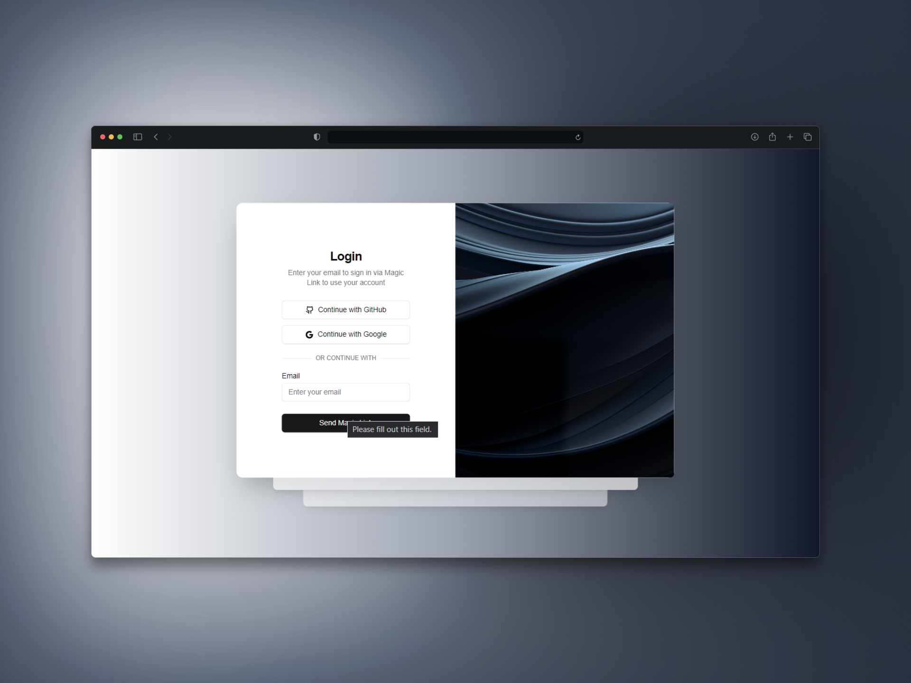

<p align="center">
   
</p>

<h1 align="center">
    <a href="#">Magic Login</a>
</h1>

<p align="center">
    A magic login project using Resend and NextAuth with GitHub and Google providers.
</p>
<p align="center">
  <a href="https://github.com/rafael-bit/authenticator-system">
  	
  </a>
</p>

# 🚀 How work

In this project, you'll find a simple implementation of a login system using [NextAuth](https://next-auth.js.org/) for authentication and [Resend](https://resend.com/) for sending emails. Authentication providers include GitHub and Google, allowing users to log in quickly and securely.

## 👷 Running Locally

#### Clone the repository

```bash
git clone https://github.com/rafael-bit/authenticator-system
```

#### Install dependencies and run the application in development mode

```bash
yarn
yarn dev
```

Open this adress in your navegation: [http://localhost:3000](http://localhost:3000/)

# 💻 Technologies

[Next.js](https://nextjs.org/), [NextAuth](https://next-auth.js.org/), [Prisma](https://www.prisma.io/), [Resend](https://resend.com/) and [Tailwind CSS](https://tailwindcss.com/).

#  🚩 Bugs

Feel free to **report a new issue** with an appropriate title and description.

# 💡 Autor

- Rafael Áquila ([@rafael-bit](https://twitter.com/rafael-bit))

# 🔧 Contributing

Verifique a página de [contribuição](https://github.com/rafael-bit/login-project/blob/master/CONTRIBUTING.MD) para ver os melhores lugares para reportar problemas, iniciar discussões e começar a contribuir.
